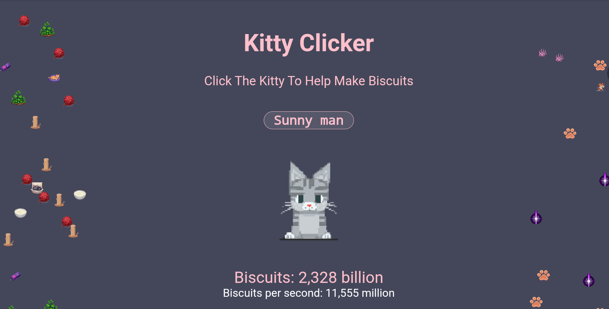

<div align="center">
  <h1 align="center">Kitty Clicker</h1>
  <p align="center">Another basic Clicker game, written during a power cut!</p>
  <p align="center">Try Kitty Clicker: [Play on GitHub Pages](https://vcore420.github.io/vKittyClicker/)</p>
  <p align="center">
    
    
    
  </p>
</div>



---

## Help the Kitty make Biscuits!

This is a Basic Clicker Game that was written when I had no power to give me something to do.

heavily inspired by the original cookie clicker game, another one I know but here's a slightly more cute and cosy clicker for all the cat lovers!

Enjoy!

---

## Core Features

- **Clicker Gameplay:**  
  Click the kitty to earn biscuits and grow your score!

- **Cat Naming:**  
  Personalize your game by naming your cat.

- **Animated Cat Sprite:**  
  The main cat animates and changes appearance as you earn more biscuits.

- **Biscuits Counter:**  
  Tracks your total biscuits with large number formatting for readability.

- **Biscuits per Second (BPS):**  
  Earn biscuits automatically over time; displayed and updated live.

- **Upgrade System:**  
    - **BPS Upgrades:** Purchase upgrades to increase your biscuits per second.
    - **Clicker Upgrades:** Boost the number of biscuits earned per click.
    - **Buff Upgrades:** Unlock powerful buffs that multiply your click or auto-upgrade effectiveness when you reach high BPS milestones.

- **Upgrade Locking & Progression:**  
  Upgrades are locked until you’ve purchased the previous one, encouraging progression.  
  Buff upgrades unlock only when you reach specific BPS thresholds.

- **Floating Upgrade Icons:**  
  Earn upgrade icons that float around the screen for a fun visual effect.

- **Collapsible Upgrade Menus:**  
  Easily show/hide sections for BPS, Clicker, and Buff upgrades.

- **Large Number Formatting:**  
  Biscuits and costs are formatted for readability (million, billion, etc.).

- **Lucky Fish Events:**  
  Special Lucky Fish events appear at random intervals.  
  Catching a Lucky Fish gives temporary boosts to biscuits per second or click strength.

- **Save and Load:**  
  Your progress is automatically saved and loaded using your browser's local storage.

- **Reset Button:**  
  Option to fully reset your game progress and start fresh.

- **Responsive Design:**  
  Works on desktop and mobile browsers.

- **Inspired by Cookie Clicker:**  
  Familiar mechanics with a unique feline twist!
  

## Getting Started

1. **Clone the repository:**
   ```bash
   git clone https://github.com/vCore420/vKittyClicker.git
   cd vKittyClicker
   ```
2. **Open `index.html` in your browser. No installation required as the game runs locally**  


## Credits

Heavily Inspired by the original and best clicker game Cookie Clicker! all rights to their original game belong to them, this project was just something fun I wanted to make!

All assets designed, created, and refined with Pixellab and Piskel. All assets are royalty-free and can be used outside this project by anyone.  
However, they may not be sold or used in any way to generate revenue.

**⚠️ This project is in early development. All game assets are test/beta and subject to change.**

## Contributors 

[](https://github.com/vCore420/vKittyClicker/graphs/contributors)

[](https://github.com/vCore420/vKittyClicker/graphs/contributors)

- Designed, written, and maintained by vCore420
- Inspired by the original Cookie Clicker

--- 

## Contributing

Pull requests and suggestions are welcome!

Or Clone your own copy to alter for yourself!

---

## License

This project is licensed under the MIT License. 

Is and Will Always be Open Source!

Please note:

This project and its assets, and any other repo by vCore, must not be sold or exchanged for any form of currency.

All rights to this project belong to everyone; free to use, modify, and share under the MIT License.
